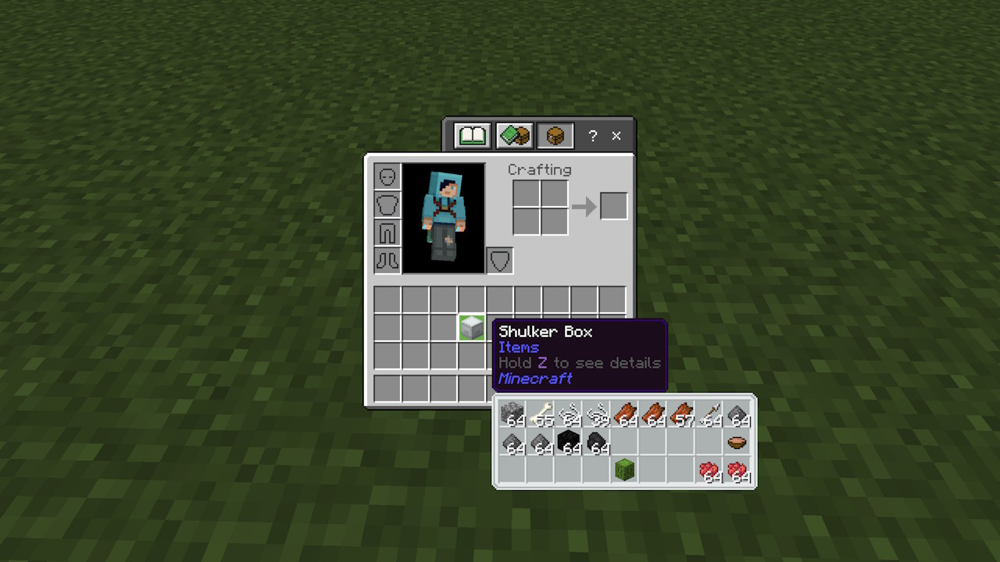
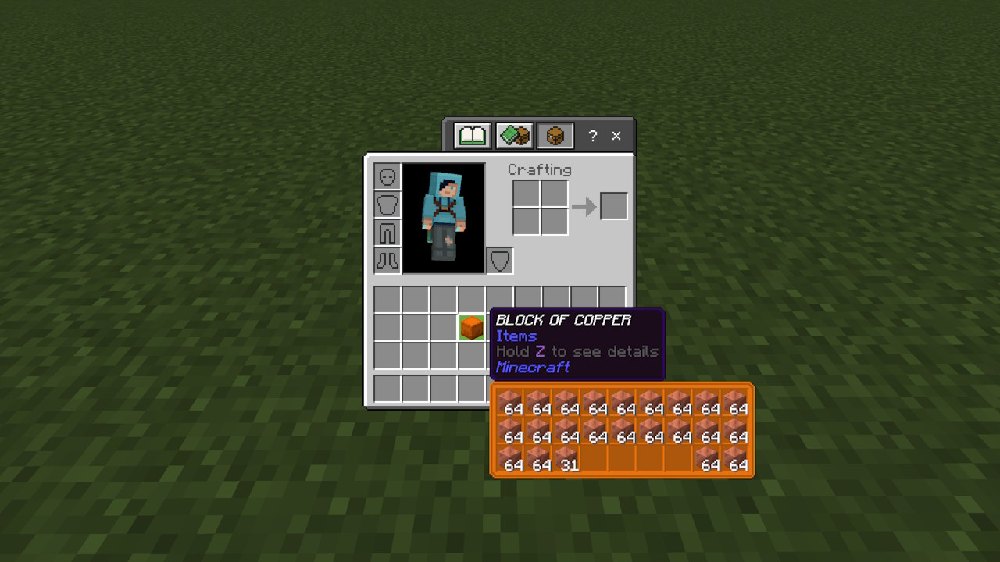
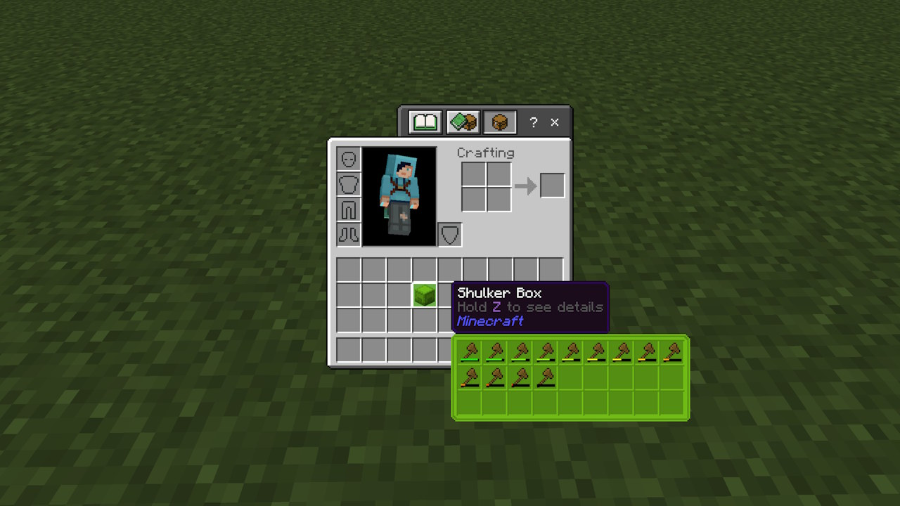
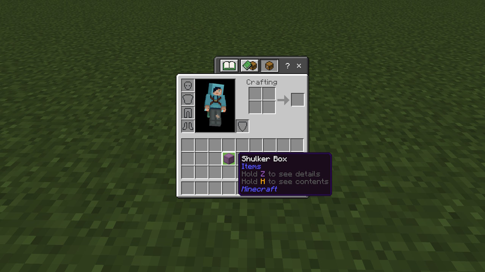

# Better Shulkers

Better Shulkers is an shulker box preview mod for Minecraft Bedrock edition, version `1.21.0.3` THe mod is an fork of [Better Inventory](https://github.com/AmethystAPI/Better-Inventory) and is built with [Amethyst](https://github.com/FrederoxDev/Amethyst). It adds colored shulker previews, that has durabilty bars and is toggeable by a keybind.

## Features

### Colored previews

### Durabilty bars

### Keybind
Hold `H` (by default) to see contents of an shulker

